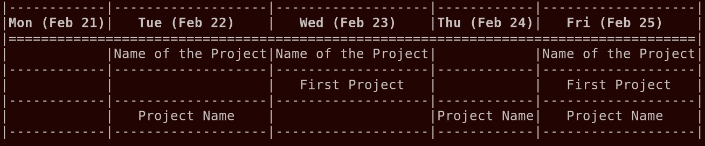

# Weekplan

Weekplan is a minimalist week planning application.
Right now, there is only a command-line interface (CLI).

The basic workflow is that you create projects which hold tasks.
You can then plan your week by adding the projects to each day where you want
to work on them.



**Supported Features:**
- Projects and Tasks
- Week planning (Schedule which project you want to work on)
- Templates (easy project creation based on templates)
- Everything is stored text-based (in JSON files)


## Installation
You can install the Python package via pip, e.g., by running
```bash
git clone https://github.com/klb2/weekplan.git
cd weekplan
pip install .
```

## Usage
The program is accessed via the `weekplan` command.
You can use `weekplan --help` to get more information.

The basic commands are
```bash
weekplan project  # for listing/creating/editing projects
weekplan task     # for listing/creating/editing tasks
weekplan week     # for listing/planning the week
```

### Projects
For working with projects, the following commands are available.

**Adding a new project:**
To add a new project, run the `weekplan project add` command.
Each project has a name and an optional description.
Additionally, you can use a template to automatically create specific tasks and
add them to the new project.
```bash
weekplan project add [--description "A long description of the project"] [-t TEMPLATE] "NAME OF THE PROJECT"
```

**Completing a project:**
Once you completed a project, you can run `weekplan project complete` and
select the project to mark it as completed.
```bash
weekplan project complete
```

**Listing all projects:**
If you just want to list all of your (active) projects, you can use the
`weekplan project list` command.
It accepts a verbosity option (`-v`) to show more details like assigned tasks
and a `-a` flag to also show completed projects.
```bash
weekplan project list [-v] [-a]
```


### Task
Similar to projects, you can create tasks and assign them to projects.
You can access these features using the `weekplan task` commands.
```bash
weekplan task COMMAND
```


### Week
The central feature of the `weekplan` application is the week planning.
You can check the current week by simply running `weekplan` (or `weekplan
week show`).

**Planning the week:**
To plan the current week, you run the `weekplan week plan` command and follow
the options in the program.
It will go through each day and you can add a project to this day by typing the
number from the list and hitting Return.
If you want to continue to the following day, simply hit Return without a
number (or explicitly type `-1`).
```bash
weekplan week plan
```
